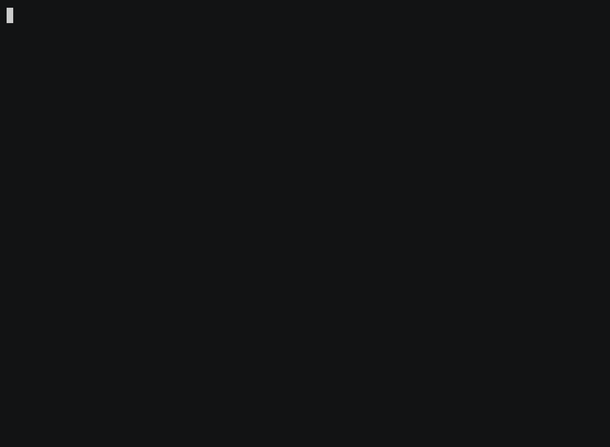
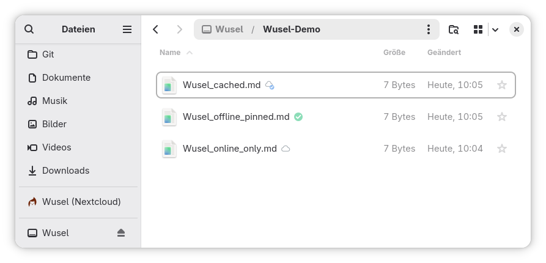

<p align="center">
  
</p>

# Wusel

**Nextcloud, woven into your desktop.**

[](https://github.com/itbh-at/wusel/actions/workflows/ci.yml)
[](https://github.com/itbh-at/wusel/actions/workflows/e2e.yml)

A virtual filesystem for Nextcloud, written in Rust — **VFS-first**: files are
"online only" by default and are only fetched on access (on-demand hydration),
instead of mirroring everything locally.

The goal is what the official client on Linux still does not offer today:
a true on-demand filesystem. `wusel` is deliberately **more than just FUSE** —
FUSE only makes the files appear; on top of it sits a full GNOME desktop
integration (sidebar, emblems, notifications, Shell search). A native macOS
frontend (File Provider, in [`macos/`](macos/)) is in the tree as experimental
work; a Windows (Cloud Filter) frontend remains planned.

**Documentation: <https://wusel.itbh.at/>** ·
**Product page: <https://itbh.at/en/wusel/>**

## What it looks like

The whole account appears as a folder; each file is fetched only when opened,
and you can pin the ones to keep offline — a real session against a real
Nextcloud:

<p align="center">
  
</p>

In a file manager, every file carries its state as an emblem — online-only,
cached, or pinned offline:

<p align="center">
  
</p>

## Architecture in one sentence

A platform-independent **engine** (`wusel-core`: Login Flow v2, WebDAV, sync,
state) plus interchangeable, thin **frontends** (`wusel-fuse` for Linux, the
File Provider extension in `macos/` over the `wusel-ipc` socket), held
together by the daemon **`wusel`**. This separation makes it possible to develop
and test the bulk of the work natively on macOS — only the mount needs a FUSE
driver.

Details: [Architecture](documentation/modules/ROOT/pages/explanation/architecture.adoc) ·
Order of work: [Roadmap](documentation/modules/ROOT/pages/project/roadmap.adoc). The
docs are an [Antora](https://antora.org) component under
[`documentation/`](documentation/), published to
<https://wusel.itbh.at/> on every push to `main` (build locally:
`./documentation/build.sh`, live: `./documentation/build.sh watch`).

## Install

Signed package repositories for Fedora, openSUSE Tumbleweed, Debian and Ubuntu
are published through the openSUSE Build Service — see [Install a
package](documentation/modules/ROOT/pages/how-to/install-a-package.adoc). The
[latest release](https://github.com/itbh-at/wusel/releases/latest) also carries
the Fedora RPMs and the Debian `.deb`s as single files — a `v*` tag builds them
for `x86_64` and `aarch64`; an Arch `PKGBUILD` is in
[`packaging/aur/`](packaging/aur/).

There are two packages. `wusel` is the mount; it needs no desktop and brings
`fuse3` and nothing else. `wusel-nautilus` is the GNOME Files integration
(emblems, context menu) and brings only what Nautilus itself uses. On Fedora
and openSUSE, `wusel` pulls it in where GNOME Files is installed; on Debian and
Ubuntu, name both: `sudo apt install wusel wusel-nautilus`.

```sh
sudo dnf install ./wusel-*.rpm
systemctl --user enable --now wusel@default
```

Full walkthrough — your Nextcloud files as a folder, from an empty machine to
open files: [on GNOME](documentation/modules/ROOT/pages/tutorials/on-gnome.adoc), [on another
desktop](documentation/modules/ROOT/pages/tutorials/on-another-desktop.adoc), or [on a
server](documentation/modules/ROOT/pages/tutorials/on-a-server.adoc). To build it yourself instead, see
[Install from source](documentation/modules/ROOT/pages/how-to/install-from-source.adoc).

### Which Nextcloud versions

Every night, `wusel` is tested against a **real Nextcloud server** — a full run
of mount, read, write, upload and 3-way merge, not a mocked API. The versions are
not written down anywhere: the workflow asks Docker Hub which majors are current
and tests the newest three, so a new Nextcloud release enters the matrix by
itself.

| Nextcloud | |
|---|---|
| newest maintained major (currently **35**) | binding — the E2E badge above turns red if it breaks |
| the two before it (currently **34**, **33**) | tested and reported, but never fail the build |

Older majors are outside Nextcloud's own maintenance and are not tested. Which
majors ran, and how each fared, is in the summary of the latest
[E2E run](https://github.com/itbh-at/wusel/actions/workflows/e2e.yml).

## Crates

| Crate           | Role                                                                          | Platform                                     |
| --------------- | ----------------------------------------------------------------------------- | -------------------------------------------- |
| `wusel-fsm`     | Decision core: occupancy and flow steps over plain data, no I/O               | everywhere                                   |
| `wusel-core`    | Engine: auth, WebDAV, sync, state                                             | everywhere                                   |
| `wusel-ipc`     | Socket frontend speaking the engine's intent protocol (used by macOS)         | everywhere                                   |
| `wusel-fuse`    | FUSE frontend (library)                                                       | Linux                                        |
| `wusel-desktop` | OS integration (notifications, file-manager status) behind `desktop::Desktop` | Linux (no-op elsewhere)                      |
| `wusel-mock`    | Mock Nextcloud server for the tests                                           | dev-only                                     |
| `wusel`         | Daemon/CLI — the product                                                      | everywhere (mount behind the `fuse` feature) |

## Usage

```sh
wusel login https://cloud.example.org   # Login Flow v2 — confirm in the browser
wusel mount ~/Wusel                 # mount (binary built with --features fuse)
wusel service enable                     # optional: auto-mount at login (systemd user service)
```

Files appear *online-only* and are streamed from the server as you read them
(pin a file to keep it offline); server-side changes propagate via `notify_push`
(with TTL revalidation, and periodic polling while `notify_push` is not
connected). Real mtimes and read-only permissions are reflected.

- **Pinning** ("always keep offline"): `wusel pin <path>` (a directory or a
  file; `wusel pin --all` for the whole account), `wusel unpin`, `wusel pins`.
- **Multiple accounts** (optional): add `--account work` to `login`/`mount`;
  `wusel accounts`, `wusel account remove <name>`. The default account needs no flag.
- **What is happening right now**: `wusel status` names the uploads still owed to
  the server, the files coming down and the rest of the work in flight
  (`--watch` to follow it). `wusel doctor` is the other half — a name-free
  diagnostics bundle you can attach to a ticket.
- **Configuration** (optional): `~/.config/wusel/config.toml` — cache
  budget/age, revalidation TTL, TLS trust (`ca_cert` / `insecure` for
  self-signed servers), mountpoint. Every key: [Configuration
  reference](documentation/modules/ROOT/pages/reference/configuration.adoc).

## Toolchain

All binaries are managed via **mise** (see `mise.toml`, Rust pinned):

```sh
mise install        # install Rust 1.97.1
```

## Developing & testing

Engine + CLI run natively on macOS (without a FUSE driver):

```sh
mise run check      # cargo check (wusel-core + wusel, no FUSE)
mise run test       # cargo test
mise run clippy
```

### Mounting

The FUSE mount runs on **Linux**. On macOS, test it inside the podman container.
Step-by-step: [Develop on macOS](documentation/modules/ROOT/pages/how-to/develop-on-macos.adoc).

```sh
mise run fuse-shell   # Linux shell with /dev/fuse (works on macOS too, via podman)
# inside the shell:
cargo run -p wusel --features fuse -- mount /mnt/nc
```

The FUSE mount is Linux-only; on a Mac, test it inside the podman container.
The native macOS frontend (File Provider, not FUSE) lives in `macos/` and is
experimental; a Windows frontend (Cloud Filter) is planned.

### CI

GitHub Actions runs the same `mise run …` tasks on every push and pull request
(`fmt-check`, `headers-check`, `shellcheck`, `clippy`, `check`, `test`,
`build-fuse`), builds the docs, runs a nightly end-to-end test against a real
Nextcloud, and publishes the RPM and `.deb` packages on a `v*` tag. Details:
[How Wusel is tested](documentation/modules/ROOT/pages/explanation/testing.adoc).

## Status

See the [Roadmap](documentation/modules/ROOT/pages/project/roadmap.adoc). Working today:

- **Engine** — authentication (Login Flow v2), the live tree (listing +
  on-demand content with real mtimes/permissions), whole-file caching with
  LRU/age eviction, change detection via `notify_push` (periodic polling when it
  is unavailable), configurable TLS
  trust, multiple accounts, pinning ("always keep offline").
- **Read-write mount** — create/edit/rename/delete, chunked upload for large
  files, lossless conflict handling with opt-in 3-way text merge.
- **Credentials** — a default-on, fail-soft OS keyring for the app password
  (opt-out via `[auth] keyring = false`; if the keyring is unusable the password
  stays in the 0600 file).
- **GNOME desktop integration** — a *Wusel (Nextcloud)* sidebar entry with live
  sync status (`libcloudproviders`), per-file emblems and a *Wusel* context
  submenu (keep offline, update, open in Nextcloud, copy link) via a native
  Nautilus extension (with live emblem refresh, packaged as `wusel-nautilus`),
  localized desktop notifications, and a GNOME Shell search provider backed by
  Nextcloud Unified Search.
- **Runs like a system component** — a systemd user service, exclusion from
  desktop indexers by default (so a crawler cannot trigger a download storm),
  `wusel cache clear` for a clean slate, and RPM, DEB and Arch packages.
- **macOS** (experimental) — a File Provider extension: files in Finder,
  offline pin/unpin from the context menu.

Next up are refinements rather than new pillars — see the roadmap: gettext i18n
for the file-manager labels, advisory locking, and the KDE equivalent of the
GNOME integration.

## Security

Found a vulnerability? Please report it privately — see [SECURITY.md](SECURITY.md).

## License

[Apache-2.0](LICENSE). Chosen so the free sources can also be shipped as signed,
commercial store builds — see
[Licence](documentation/modules/ROOT/pages/project/licence.adoc).
